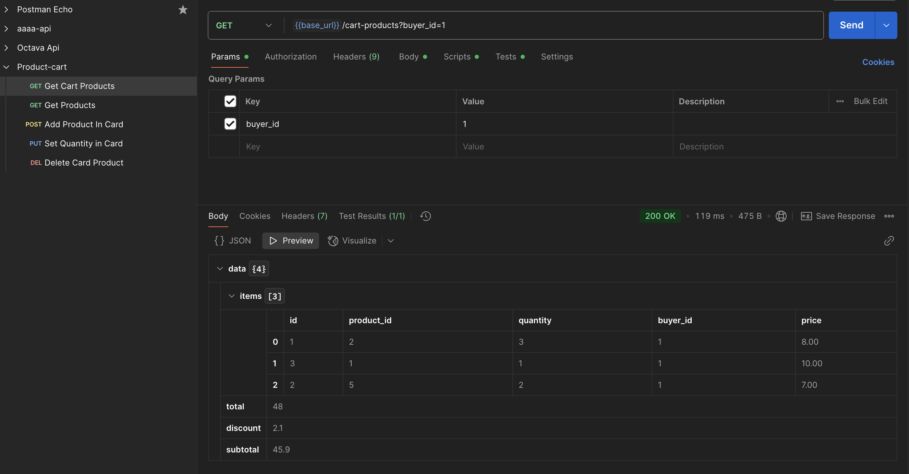

# PRODUCT CART Endpoint

Laravel-ზე აწყობილი პროდუქტების კალათაში დამატება, რაოდენობის განახლება და წაშლა




## ინსტალაცია

.env.example ფაილის კოპირება და .env ფაილის შექმნა
```bash
  cp .env.example .env
```

sail-ის გაშვება
```bash
  sail up -d
```

ბაზის მონაცემების განახლება

```bash
  sail artisan migrate:fresh --seed
```


```
```


1. Postman კოლექცია:  
   [`Product-cart.postman_collection.json`](public/Product-cart.postman_collection.json)

2. Environment ცვლადები:
    - `base_url` → : `localhost/api/v1`
